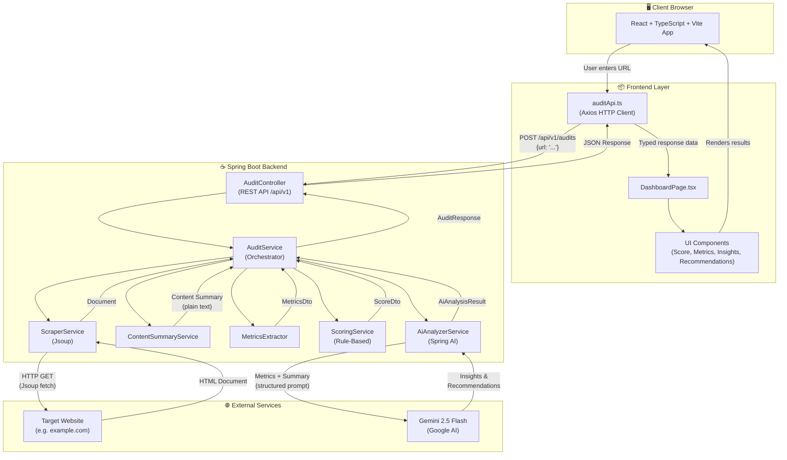
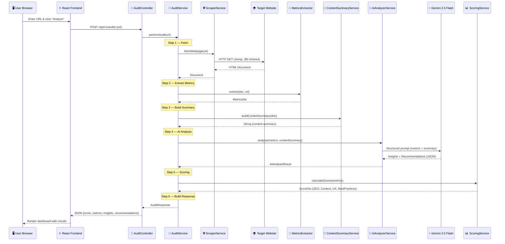

# WebPulse.AI — System Architecture

---

## 1. High-Level System Architecture



---

## 2. Audit Request Data Flow (Sequence)



---

## 3. AI Design Decisions

> *"Why did you use AI, where did you use AI, and what decisions did you make when integrating AI into your solution?"*

### 3.1 Why AI Was Used

Website metrics like heading counts and link totals can be evaluated with simple rules:

```
H1 count = 1 → Good
H1 count = 0 → Bad
```

But some aspects of a website **cannot be evaluated with fixed rules**:

- *Is the messaging clear and compelling?*
- *Are the CTAs persuasive enough to drive conversions?*
- *Is the content genuinely useful to the target audience?*
- *Does the page structure create a logical reading flow?*

These are **subjective, context-dependent judgments** that require natural language understanding — exactly what a large language model excels at.

**Decision:** Use AI specifically for qualitative analysis (insights & recommendations), while keeping quantitative analysis (metrics & scores) rule-based.

---

### 3.2 Why AI Is NOT Responsible for Scoring

This is the most important architectural decision in the project.

| Approach | Scoring | Insights |
|----------|---------|----------|
| Alternative | AI calculates everything | AI generates everything |
| **Our approach** | **Deterministic rules** | **AI generates** |

**Why separate scoring from AI?**

| Benefit | Explanation |
|---------|-------------|
| **Consistency** | The same webpage always produces the same score. No variance between runs. |
| **Explainability** | Every score maps to a clear rule. Users can understand *why* they scored a certain way. |
| **Testability** | Rule-based scoring can be unit tested with predictable inputs and outputs. |
| **No hallucination risk** | AI models can fabricate numbers. Deterministic scoring eliminates this entirely. |
| **Lower cost** | Scoring doesn't consume API tokens since it runs locally. |

```
Scoring Pipeline (No AI):

MetricsDto → ScoringService → ScoreDto
                ↓
        Rule-based logic:
        • SEO score      (meta tags, headings, alt text)
        • Content score   (word count, reading time, text ratio)
        • UX score        (CTAs, structure, images)
        • Best Practices  (links, accessibility)
                ↓
        Overall WebPulse Score (weighted average)
```

---

### 3.3 Why Spring AI Was Chosen

| Approach | Pros | Cons |
|----------|------|------|
| Direct Gemini REST API | Full control | Manual HTTP handling, JSON parsing, error handling, boilerplate |
| **Spring AI**  | Clean integration, fits ecosystem | Slight abstraction overhead |

**Why Spring AI over direct API calls?**

- **Native Spring Boot integration** — Works with dependency injection, configuration properties, and the Spring lifecycle
- **Provider abstraction** — Switching from Gemini to OpenAI or Anthropic requires changing a dependency, not rewriting code
- **Structured output parsing** — Spring AI handles JSON response parsing into Java objects automatically
- **Less boilerplate** — No manual HTTP client setup, request building, or response deserialization

```java
// Spring AI approach (clean)
AiAnalysisResult result = aiAnalyzerService.analyze(metrics, contentSummary);

// vs. Direct REST API approach (verbose)
HttpRequest request = HttpRequest.newBuilder()
    .uri(URI.create("https://generativelanguage.googleapis.com/..."))
    .header("Authorization", "Bearer " + apiKey)
    .POST(HttpRequest.BodyPublishers.ofString(buildJsonPayload(metrics)))
    .build();
HttpResponse<String> response = client.send(request, ...);
AiAnalysisResult result = objectMapper.readValue(response.body(), ...);
```

---

### 3.4 Why Content Summary Was Sent Instead of Full HTML

| Approach | What is sent to AI |
|----------|--------------------|
| Alternative | Entire raw HTML document |
| **Our approach** | **Extracted metrics + heading structure + content summary** |

**Why not send the full HTML?**

| Benefit | Explanation |
|---------|-------------|
| **Smaller prompts** | A typical webpage is 50–200KB of HTML. Our summary is ~2KB. |
| **Lower token usage** | Fewer tokens = faster responses + lower API cost |
| **Focused analysis** | AI receives only what matters — no CSS, scripts, or boilerplate markup |
| **Security** | Raw HTML could contain scripts or sensitive data. Summaries are sanitized. |
| **Better results** | Less noise means the AI focuses on actual content quality |

```
What we send to Gemini:

┌─────────────────────────────────┐
│  Extracted Metrics              │
│  • Word count: 1,250            │
│  • H1 count: 1                  │
│  • Images: 8 (25% missing alt)  │
│  • Internal links: 12           │
│  • Text-to-HTML ratio: 0.35     │
├─────────────────────────────────┤
│  Heading Structure              │
│  • H1: "Welcome to Our Store"   │
│  • H2: "Featured Products"      │
│  • H2: "Customer Reviews"       │
├─────────────────────────────────┤
│  Content Summary                │
│  First 500 chars of body text   │
└─────────────────────────────────┘

What we do NOT send:
✗ Raw HTML tags
✗ CSS stylesheets
✗ JavaScript code
✗ Base64 images
✗ Third-party tracking scripts
```

---

### 3.5 Why Fallback Recommendations Exist

AI services are external dependencies. They can fail due to rate limits, network issues, or API outages.

```
                    ┌──────────────┐
                    │  AI Service  │
                    │  Available?  │
                    └──────┬───────┘
                           │
                ┌──────────┴──────────┐
                │                     │
               Yes                    No
                │                     │
    ┌───────────┴──────────┐  ┌──────┴───────────┐
    │  Generate AI-powered │  │  Generate rule-   │
    │  insights &          │  │  based fallback   │
    │  recommendations     │  │  recommendations  │
    └──────────────────────┘  └──────────────────┘
                │                     │
                └──────────┬──────────┘
                           │
                    ┌──────┴───────┐
                    │  User always │
                    │  gets results│
                    └──────────────┘
```

**Why this matters:**

- **Reliability** — The application never shows a blank screen due to an AI failure
- **Graceful degradation** — Users still receive useful, metrics-based recommendations
- **Production readiness** — Demonstrates defensive programming practices

---

## 4. Trade-offs

Several trade-offs were made to keep the solution practical within the scope and timeline of the assignment.

### 4.1 Single Page Analysis vs Full Website Crawling

The current implementation analyzes a single webpage rather than crawling an entire website.

| | Detail |
|---|--------|
| **Benefit** | Simpler architecture, faster audit execution, lower resource consumption |
| **Trade-off** | Site-wide SEO and content issues cannot be identified |

### 4.2 Deterministic Scoring vs AI-Generated Scoring

Website scores are calculated using rule-based logic while AI is used only for insights and recommendations.

| | Detail |
|---|--------|
| **Benefit** | Consistent and explainable results, easier testing, reduced hallucination risk |
| **Trade-off** | Scoring logic is less flexible than a fully AI-driven evaluation |

### 4.3 Content Summary vs Full Page Context

Only extracted metrics, heading structure, and a summarized version of page content are sent to Gemini.

| | Detail |
|---|--------|
| **Benefit** | Lower token usage and API costs, faster response times, smaller prompts |
| **Trade-off** | AI may miss some context available in the full webpage content |

### 4.4 Lightweight SEO Audit vs Enterprise SEO Analysis

The current implementation focuses on commonly used SEO, content, and UX signals.

| | Detail |
|---|--------|
| **Benefit** | Easier to understand and maintain, suitable for the assignment scope |
| **Trade-off** | Does not cover all factors considered by modern search engines |

### 4.5 No Performance Auditing

Core Web Vitals and Lighthouse metrics are not included.

| | Detail |
|---|--------|
| **Benefit** | Reduced implementation complexity, faster development |
| **Trade-off** | Performance-related quality signals are not measured |

---

## 5. Future Improvements

The current implementation focuses on a lightweight and practical website quality assessment that could be completed within the scope of the assignment. However, the research and industry resources reviewed during development suggest that modern website quality evaluation extends far beyond the metrics currently implemented.

Google's [SEO Starter Guide](https://developers.google.com/search/docs/fundamentals/seo-starter-guide), [Helpful Content Guidelines](https://developers.google.com/search/docs/fundamentals/creating-helpful-content), [Search Quality Evaluator Guidelines (E-E-A-T)](https://guidelines.raterhub.com/searchqualityevaluatorguidelines.pdf), and [Core Web Vitals](https://web.dev/vitals/) documentation highlight the importance of content quality, user experience, accessibility, trustworthiness, and technical performance in addition to traditional SEO signals.

Similarly, academic research such as *Layout-Aware Webpage Quality Assessment* and *Document Quality Scoring for Web Crawling* shows that webpage quality is also influenced by factors such as content organization, page structure, semantic value, user-focused design, and overall information quality.

Given additional development time, the following enhancements would strengthen WebPulse AI:

| Enhancement | Description |
|-------------|-------------|
| **Comprehensive Technical SEO** | Canonical tags, structured data (JSON-LD), Open Graph metadata, robots directives, sitemap validation |
| **Content Quality Assessment** | Helpfulness evaluation aligned with Google's Helpful Content principles and E-E-A-T signals |
| **Accessibility Auditing** | WCAG compliance checks, color contrast analysis, screen reader compatibility, keyboard navigation |
| **Multi-Page Crawling** | Website-wide analysis across multiple pages to identify site-level SEO and content patterns |
| **Core Web Vitals** | LCP, FID, CLS measurement through Lighthouse / PageSpeed Insights API integration |
| **AI-Driven Quality Scoring** | Enhanced assessment based on page structure, content organization, and trust signals |
| **Competitive Benchmarking** | Comparative analysis against competitor websites for relative performance evaluation |

These enhancements would allow WebPulse AI to evolve from a basic website auditing tool into a more comprehensive website quality assessment platform aligned with modern search engine guidelines, industry best practices, and current academic research.
